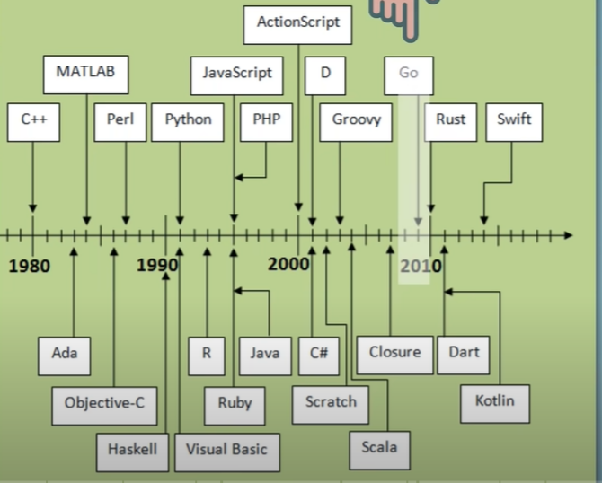
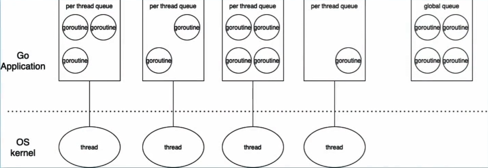

# Go

# Basic Info

1. 2007 google 2009 open source



1. use cases 
    1. for performant applications 
    2. runing on scaled distributed systems
2. characterics 
    1. simple syntax, Easy to learn read and write code  
    2. fast build time start up and run 
    3. require fewer resources
    4. faster than interpreted languages like python
    5. consistent across different os
    
3. install
4. vscode：go extension ***Go team at Google***

# first code

## hello world

1. init module *`go mod init <module path>`*
2. all our code must belong to *`**packages` — the first statement in Go file must be ‘package…’***
3. the **“main function”** is the **entrypoint** of a Go program
4. A program can only have 1 main function because you can only have 1 entrypoint
5. Go packages: 
    1. Go programs are organized into packages
    2. Go’s standard library, provides different core packages for us to use
    3. ‘fmt’ is one of these, which you can use by importing it
    4. a package is a collection of source files
6. go run <file name> = compiles and runs the code

# Variable

1. Variable must be used
2. Constants are like variables, except their values **cannot be changed**.

## printf

pkg.go.dev/fmt：print formatted data

- It takes a **template string** that contains the text that need be formatted.
- plus some **annotation verbs(placeholder)** that tells the fmt functions how to format the variable passed in.

# Data Types

Go is a statically typed language

- you need to tell go compiler, the data type when declaring the variable
- Type Inference: BUT Go can infer the type when you assign a value

| Go | Java |
| --- | --- |
| int8 | byte |
| int16 | short |
| int32 | int |
| int64 | long |

sytactic suger in Programming

- a term to describe a feature in a language that let you do smth more easily
- make the language ‘sweeter’ to human use
- But doesn’t add any new functionality that it didn’t already have

# Get user input

**fmt → formatted Input and Output(I/O)**

- Print Messages
- Collect User Input
- Write into a File

Pointer

- A pointer is a variable that points to the memory address of another variable
- a special variable

# Array

- Fixed Size how many elements the array can hold
- Only the **same data type** can be stored.

```bash
var variable_name [size]data_type
```

# Slice

- Slice is an **abstraction of the array**
- Slices are more flexible and powerful: **variable-length** or get an sub-array of its own
- Slices are also **index-based** and have a size, but is **resized when needed**

append 

- Adds the element **at the end of the slice**
- **Grows the slice if a greater capacity is needed** and return the updated slice value

# Loops

- In general, Languages provide various control structures to control the application flow
- a loop statement allows us to execute code multiple times, in a loop
- only have ‘**for**’ loop

Range

- Range **iterates over elements for different data structures** (so not only arrays  and slices)
- For arrays ans slices, **range provides the index and value for each element**.

string.Fields()

- Splits the string with white space as separator
- And return a slice with the split elements

Blank identifier

- to ignore a variable you don’t want to use
- So with Go you need to make unused variables explicit

# Condition

if statement {}

break statement

- Terminate the for loop
- And continues with the code right after the for loop

continue statement

- Cause loop to skip the remainder of its body
- And immediately retesting its condition

switch statement

- allows a variable to be tested for equality against a list of values
- default handle the case, if not match is found

# Functions

- **Encapsulate code** into own container  which logically belong together
- Like variable name, you should give a funtion a **descriptive name**
- **call the function by its name**, whenever you want to execute this block of code
- every program has at least one funtion, which is the **main()** function

- Funtion is only executed when *called*
- you can call a function as many times you want
- so funtion is also used to **reduce code duplication**

parameters 

- information can be passed into funtions as parameters
- parameters are also call arguments

Mutiple packages

exporting a variable

- make it avaiable for all packages in the app
- Capitalize first letter

3 level of scope 

local

- declaration within function → can be used only with that function
- declaration within block → can be used only within that block

package

- declaration outside all funtions → can be used everywhere in the same package

global

- declaration outside all functions & uppercase first letter → can be used everywhere across all packages

variable scope

scope is the region of a program, where a defined variable can be accessed 

maps

- maps unique keys to values
- you can retrieve the value by using its key later
- all keys have same data types — all values have same data types

struct

the type keyword creates a new type, with the name you specify

In fact, you can create a type based on every other data type like int, string etc

# goroutine

concurrency

go keyword

- “go…” starts a new goroutine
- A goroutine is a **lightweight thread** managed by Go runtime

# Waitgroup

- wait for the launched goroutine to finish
- Package “sync” provides basic synchronization functionality
- **Add**: sets the number of goroutines to wait for (increases the counter by the provided number)
- **Wait**: Blocks until the WaitGroup counter is 0
- **Done**: decrements the WaitGroup counter by 1 so this is called by the goroutine to indicate that its finished

built-in functionality for goroutine to talk with one another

comparison to other languages 

| writing concurrent code | writing concurrent code is more complex more overhead |
| --- | --- |
| Threads vs Goroutines | creating threads is more expensive  slow startup time / heavyweight and needs more hardware resources |

why? what is the different?
| Goroutine | OS Threads |
| --- | --- |
| Go is using, what’s called a “green thread” | managed by kernel |
| Abstraction of an actual thread  | are hardware depent |
| Managed by the go runtime, we are only interacting with these high level goroutines | cost of these threads are higher |
| cheaper & lightweight | higher start up time |
| you can run hundreds of thousands or millons goroutines without affecting the performance  | -- |
